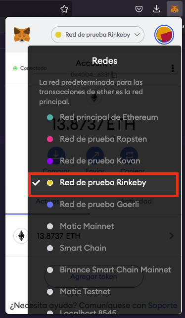
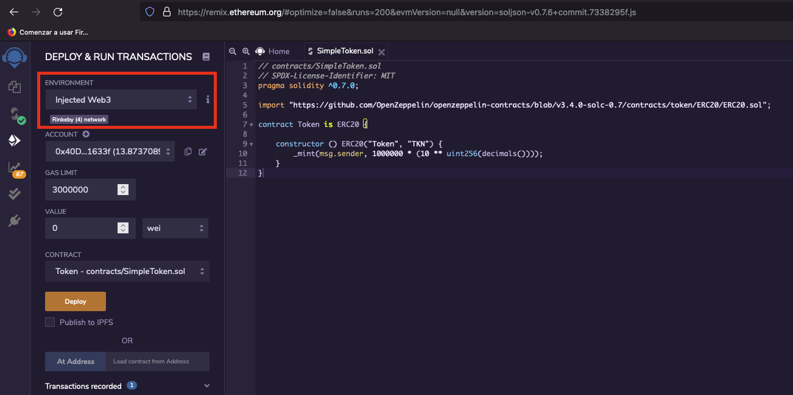

# SIMPLE TOKEN

## MetaMask Connection

Check that you are connected to any Ethereum testnet like Rinkeby:

## Deploy

Go to [Remix](https://remix.ethereum.org) and copy the SmartContract code you can find in `./contracts/SimpleToken.sol` and then check that `Environment` is defined as `Injected Web3`:

After that, you can deploy your token